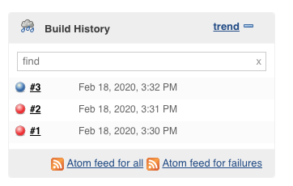
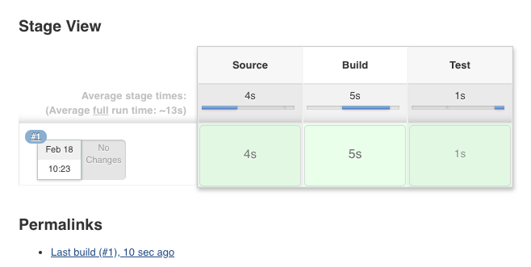

# Jenkins

## Setup

### Getting a Jenkins ready image.

If using latest bakerx:
```
$ bakerx --version
bakerx@0.6.8
virtcrud@18ae833
```

Download jenkins image from Github Releases.

```
bakerx pull CSC-DevOps/Images#Spring2020 jenkins
```

🚧 Otherwise, if you have not updated bakerx, use this hack to add jenkins image to the bakerx registry. *Note*: you will want to run in Git Bash if on Windows:

```bash
$ mkdir -p ~/.bakerx/.persist/images/jenkins
$ wget https://github.com/CSC-DevOps/Images/releases/download/Spring2020/jenkins.box -O jenkins.box
$ tar -xvf jenkins.box -C ~/.bakerx/.persist/images/jenkins
```

### Provision jenkins server.

Now that we have an image, let's provision a VM.

```bash
$ bakerx run jenkins jenkins --ip 192.168.44.80 --memory 2048
```

Get initial admin password.

```
$ baker ssh jenkins
vagrant@ubuntu-bionic:~$ sudo cat /var/lib/jenkins/secrets/initialAdminPassword
```

## Exploring Jenkins

➡️ Visit http://192.168.44.80:8080.


### Jenkins > Home Page


### Jenkins > Project Types


### Creating a Freestyle Project

On the Jenkins Home Page click Jenkins > New Item. Enter a project name "free", then select Free Style Project, then click "Ok" on the bottom of the page.

Once the project is created, enter the following, inside Build > Add Build Step [Execute Shell]:

```
git clone https://github.com/CSC-DevOps/App
cd App
npm install
npm test
```

Hit `Save` on the bottom of the page. 

Next, on the project home page, manually trigger a build by clicking "Build Now".



### Using Jenkins Job Builder

```bash
vagrant@ubuntu-bionic:~$ jenkins-jobs --user admin --password admin update test-pipeline.yml 
WARNING:jenkins_jobs.config:Config file, /etc/jenkins_jobs/jenkins_jobs.ini, not found. Using default config values.
INFO:jenkins_jobs.cli.subcommand.update:Updating jobs in ['test-pipeline.yml'] ([])
INFO:jenkins_jobs.builder:Number of jobs generated:  1
INFO:jenkins_jobs.builder:Creating jenkins job test-pipeline
INFO:jenkins_jobs.cli.subcommand.update:Number of jobs updated: 1
INFO:jenkins_jobs.builder:Number of views generated:  0
INFO:jenkins_jobs.cli.subcommand.update:Number of views updated: 0
```

