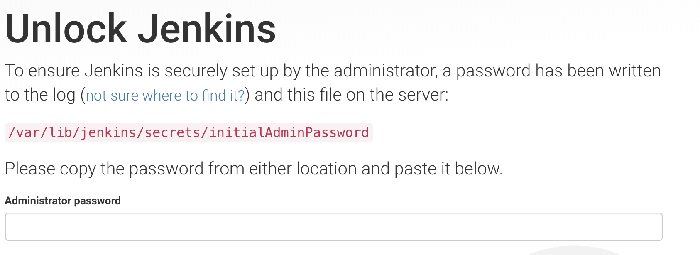
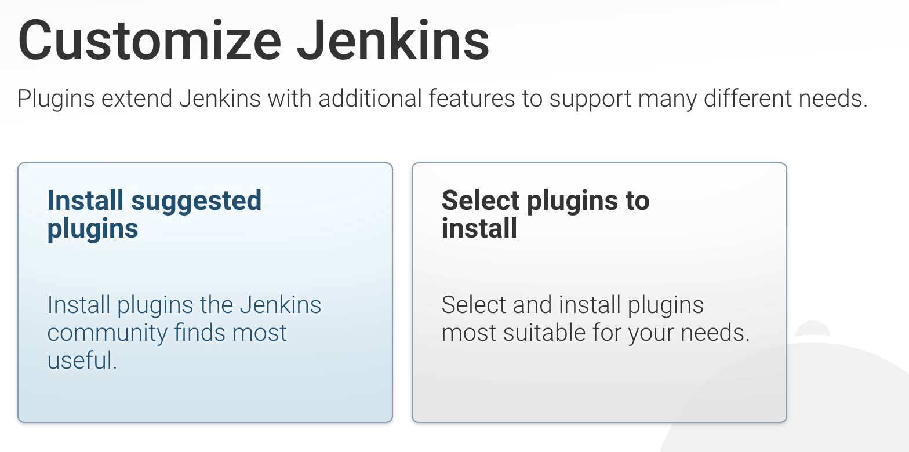
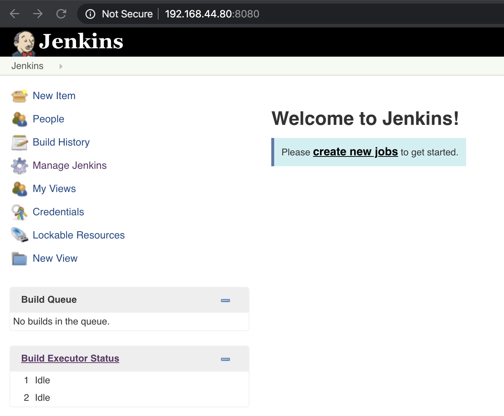
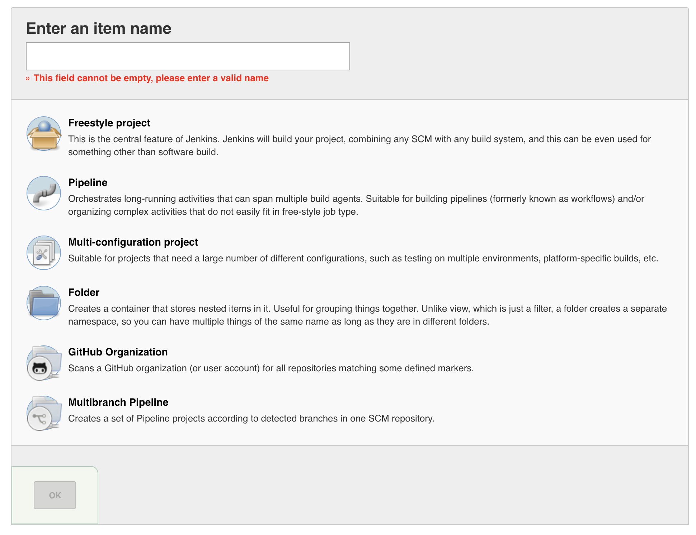

# Jenkins

Hack to add jenkins image to bakerx registry.

```bash
$ mkdir -p ~/.bakerx/.persist/images/jenkins
$ wget https://github.com/CSC-DevOps/Images/releases/download/Spring2020/jenkins.box -O jenkins.box
$ tar -xvf jenkins.box -C ~/.bakerx/.persist/images/jenkins
```

Provision jenkins server.

```bash
$ bakerx run jenkins jenkins --ip 192.168.44.80 --memory 2048
```

Get initial admin password.

```
$ baker ssh jenkins
vagrant@ubuntu-bionic:~$ sudo cat /var/lib/jenkins/secrets/initialAdminPassword
```

### Exploring Jenkins

➡️ Visit http://192.168.44.80:8080.








